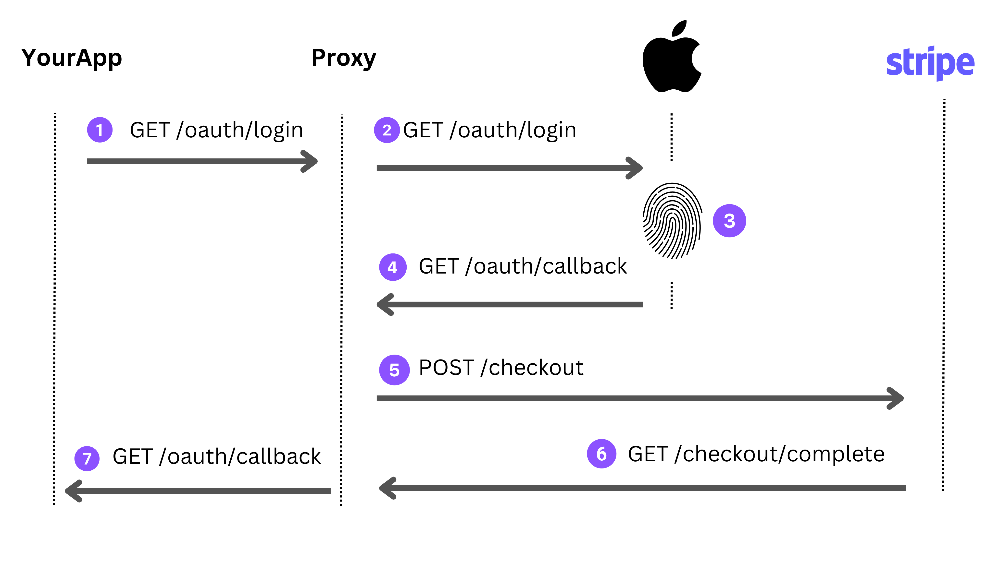

OAuth Proxy Experiment
----------------------

Wraps existing OAuth Providers for the purpose of adding a payment step during sign-up.

## How it works

When the user signs in, they are silently redirected to the upstream OAuth server (Google, Apple, etc..). If it's their first time signing in, they are sent into a Stripe Checkout to pay for a subscription. And then redirected back to the original app.

This proxy also provides an access token containing the user's Stripe `customer_id`, `subscription_id`, `payment_status` & `plan`.

## Why?

All languages and frameworks already support OAuth. With this proxy, people building a SaaS wouldn't need to build a custom payment integration. This proxy can wrap any OAuth compliant server and add a payment flow.

## Sequence Diagram

1. User clicks a "sign in" link
2. Silently redirected to OAuth provider (ie Apple)
3. User authorizes app
4. Redirected to proxy
5. Silently redirected to Stripe Checkout
6. Redirect back to Proxy
7. Silently redirected back to app

From user's perspective:

They click a sign in link, got presented with Stripe checkout, and one they pay they're back on the original site.

From the developer's perspective:

They didn't need to code any payment stuff. Just use any OAuth library provided by their framework/language (Node.js, Ruby, Python, dotnet etc..)
